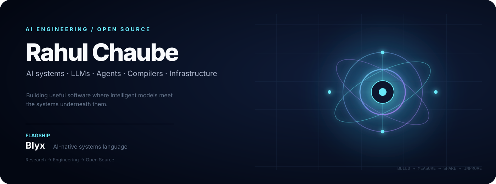

<div align="center">



### AI Engineer · Founder · Open-Source Builder

**AI systems · LLMs · Agents · Compilers · Developer Infrastructure**

[](https://github.com/Rahulchaube1)
[](https://www.linkedin.com/in/rahul-chaube-2520b21b7/)
[](https://github.com/Rahulchaube1)

**[✦ Enter the interactive Three.js profile](./3d-profile/index.html)**

</div>

---

## About

I build software at the intersection of **AI and systems engineering** — from LLM-powered applications and agents to programming languages, compilers, developer tools, and AI infrastructure.

My goal is to turn ambitious ideas into software that is **useful, reproducible, maintainable, and open to contribution**.

### Current focus

- 🤖 **AI / LLM engineering** — agents, inference, model-powered products
- ⚙️ **Systems engineering** — compilers, runtimes, concurrency, performance
- 🧩 **Programming languages** — language design, type systems, IRs, tooling
- 🧠 **AI infrastructure** — compute, accelerators, experimentation
- 🌍 **Open source** — projects, documentation, tests, and contributor workflows

---

## Featured projects

<table>
<tr>
<td width="33%" valign="top">

### 🧬 Blyx

**AI-native systems programming language**

Exploring AI-oriented computation, concurrency, tensors, heterogeneous computing, and native compilation.

**Stack:** Rust · Compiler · BIR/SSA

**[Repository →](https://github.com/Rahulchaube1/blyxxxx)**  
**[Website →](https://blyx-lang.space)**  
**[Playground →](https://play.blyx-lang.space)**

</td>
<td width="33%" valign="top">

### 🥽 AR Studio

**Interactive AR/VR creation workspace**

Combines hand tracking, 2D drawing, 3D creation, gesture interaction, and persistent sessions.

**Stack:** React · Three.js · MediaPipe

**[Repository →](https://github.com/Rahulchaube1/AR)**

</td>
<td width="33%" valign="top">

### 🗺️ MapNepal

**Open-source geospatial platform**

A full-stack mapping application for Nepal with terrain, landmarks, trekking routes, search, and routing.

**Stack:** MapLibre · Node.js · Express

**[Repository →](https://github.com/Rahulchaube1/mapnepal)**  
**[Live demo →](https://mapnepal-nj91.vercel.app)**

</td>
</tr>
</table>

---

## Engineering interests

```text
AI / LLMs          → agents · inference · AI-native applications
Systems            → compilers · runtimes · concurrency · performance
Languages          → type systems · IRs · language tooling
AI Infrastructure  → compute · accelerators · distributed systems
Developer Tools    → CLI · automation · DX · testing
Open Source        → RFCs · documentation · reproducibility · community
```

---

## Technology

**Languages**  
`Python` `Rust` `C++` `TypeScript` `JavaScript`

**AI / ML**  
`PyTorch` `LLMs` `Agents` `Inference`

**Systems / Web**  
`Linux` `Docker` `GitHub Actions` `React` `Node.js` `Three.js`

---

## Open source

I welcome collaboration from engineers, researchers, students, and builders working on **AI systems, programming languages, compilers, infrastructure, and developer tools**.

Good contribution paths include:

- 🐛 reproducible bug reports
- 🧪 tests and experiments
- 📚 documentation and examples
- ⚡ performance work
- 🧩 focused features
- 💡 language and architecture RFCs

For substantial changes, start with an issue or RFC so the design can be discussed before implementation.

---

## What I'm building toward

> **AI-native software that is technically deep, useful in practice, and open enough for others to build on.**

I'm particularly interested in the boundary between **AI models and the systems underneath them** — languages, runtimes, compute, agents, and developer infrastructure.

---

## Connect

If you're building something interesting in AI, systems, open source, or developer infrastructure, I'd be glad to connect.

- **GitHub:** [@Rahulchaube1](https://github.com/Rahulchaube1)
- **LinkedIn:** [Rahul Chaube](https://www.linkedin.com/in/rahul-chaube-2520b21b7/)

<div align="center">

**Build → Measure → Share → Improve**

⭐ Star useful projects · 💬 Start a discussion · 🤝 Contribute · 📢 Share what you learn

</div>
